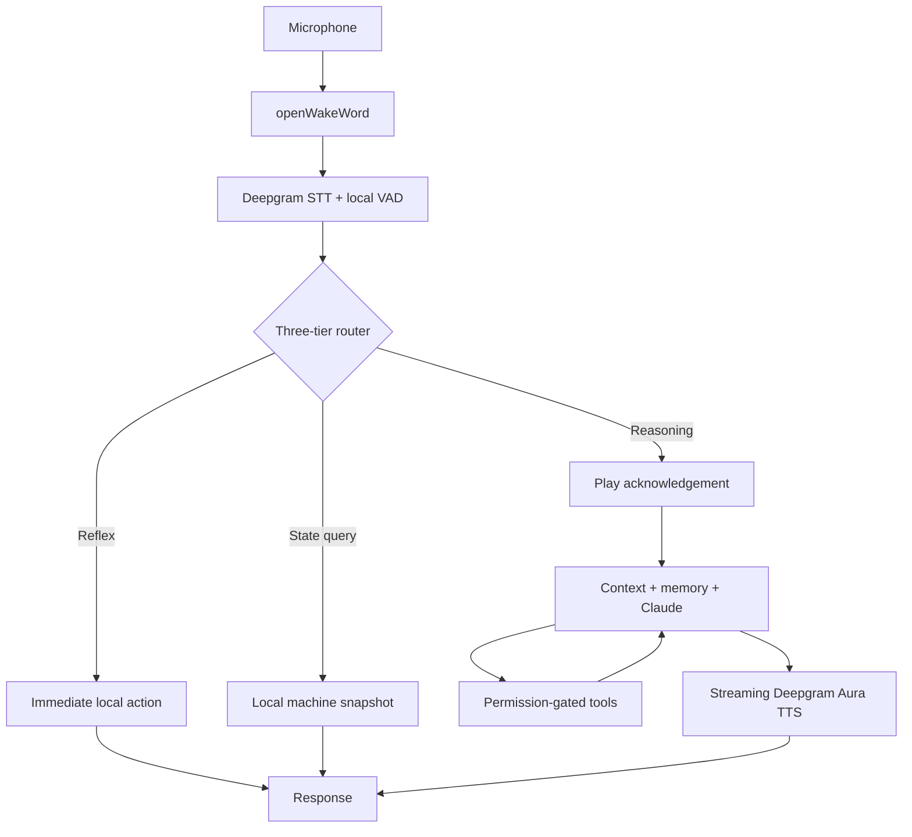

<h1 align="center">F.R.I.D.A.Y</h1>

<p align="center">A low-latency, voice-first AI assistant for a Linux developer workstation.</p>

<p align="center">
  <a href="GOLIVE.md">Go-live runbook</a> ·
  <a href="#quickstart">Quickstart</a> ·
  <a href="#measured-performance">Results</a>
</p>

FRIDAY listens for a wake word, transcribes speech, decides whether a request can be handled locally, and streams the answer back through speech. It is built for the questions and interruptions that happen while developing: “what branch am I on?”, “is the server running?”, “stop”, or a task that needs an LLM and tools.

The key design choice is a three-tier router. Reflexes and machine-state queries stay local; only open-ended work reaches Claude. That keeps common turns fast, reduces API use, and puts explicit permission checks in front of machine-changing tools.

> [!NOTE]
> This is a Linux desktop project, not a cross-platform voice assistant. It expects a PipeWire/PulseAudio-compatible audio session and currently uses the bundled openWakeWord phrase **“alexa”** by default.

## What works

- Streaming wake word → STT → routing → reasoning → TTS loop
- Local answers from Git, processes, ports, tmux, battery, disk, and memory state
- Pre-rendered acknowledgements while reasoning is in progress
- Barge-in by saying the wake word during playback
- SQLite FTS5 long-term memory with bounded prompt retrieval
- Gated local tools and optional Exa web search
- Microphone arbitration that yields to calls, meetings, and recording apps
- Authenticated local WebSocket gateway and scriptable CLI
- Direct daemon mode or systemd user-service operation
- Structured latency spans and 367 automated tests

## Quickstart

### Requirements

- Linux with Python 3.11+
- PipeWire or PulseAudio compatibility, including `pactl`
- [uv](https://docs.astral.sh/uv/)
- Deepgram and Anthropic API keys
- `git` and `tmux` for workstation-state and agent features

```bash
git clone https://github.com/MaheshBhushan/F.R.I.D.A.Y.git
cd F.R.I.D.A.Y
uv sync --dev

mkdir -p ~/.friday
printf 'export DEEPGRAM_API_KEY=%s\nexport ANTHROPIC_API_KEY=%s\n' \
  'YOUR_DEEPGRAM_KEY' 'YOUR_ANTHROPIC_KEY' > ~/.friday/env
chmod 600 ~/.friday/env

uv run friday doctor
uv run friday start --foreground
```

The repository is private, so cloning requires GitHub authentication. Keep `~/.friday/env` outside the repository; FRIDAY loads it at startup.

## Usage

In another terminal:

```bash
uv run friday status
uv run friday ask "what branch am I on"
uv run friday ask --speak "what is running"
uv run friday say "the build is green"
uv run friday hear --seconds 20
uv run friday logs -f
uv run friday update
uv run friday stop
```

A local state query returns a direct answer without an LLM call:

```text
$ uv run friday ask "what branch am I on"
[state_query] You're on main in friday (dirty).
```

Install the supplied systemd user service with:

```bash
uv run friday install --now
```

> [!WARNING]
> [`deploy/friday.service`](deploy/friday.service) contains an absolute path for the original checkout. Update its `WorkingDirectory`, `ExecStart`, and `ExecStartPost` paths before installing it elsewhere.

## Architecture



The voice loop and WebSocket gateway run as supervised sibling tasks. A gateway failure cannot take down microphone capture, and the gateway reports whether the voice loop is actually healthy.

## Measured performance

These are live measurements recorded in [`GOLIVE.md`](GOLIVE.md), not estimates. Latencies are reported as percentiles where a distribution was measured.

| Stage | Result | Method |
|---|---:|---|
| Wake inference | 2.4 ms + 80 ms audio chunk | Local pretrained model |
| Local VAD | 0.31 ms | Local WebRTC VAD |
| Acknowledgement audible | 111.9 ms p99 | Real Aura acknowledgement bank and speaker |
| State query | 36.9 ms | Real local snapshot, no LLM |
| First content audio | 226 ms | Live Aura stream |
| Reasoning TTFT | ~1.0–2.7 s | Live Claude Opus 5 turns |
| Shutdown with turn in flight | 183 ms | Live assembled loop |

The reasoning TTFT misses the original 300–600 ms target. FRIDAY hides part of that delay with an acknowledgement; materially faster first content would require routing simple reasoning turns to a smaller model.

## Safety model

Tool names are explicitly allowlisted and mapped to a risk level:

| Risk | Behaviour |
|---|---|
| Read-only | Runs after input sanitisation |
| Safe and reversible | Runs automatically |
| Machine-modifying | Requires approval |
| Destructive or unknown | Explicit approval or default denial |

The gateway binds to `127.0.0.1` by default and requires a token. Sensitive `/proc` paths are blocked, command arguments are sanitised, and web queries resembling credentials or local-data dumps are rejected before network access.

## Repository structure

```text
src/friday/
├── audio/       microphone priority and echo cancellation
├── core/        supervision, events, and latency spans
├── gateway/     authenticated WebSocket control plane
├── tiers/       local state-query answering
├── tools/       tool registry, execution, and sanitisation
├── voice/       wake detection, STT, acknowledgements, and TTS
├── brain.py     context assembly and Claude tool loop
├── loop.py      assembled end-to-end voice loop
├── memory.py    SQLite FTS5 memory
├── router.py    three-tier intent classifier
└── cli.py       lifecycle and interaction commands
tests/           automated test suite with fake service transports
training/        resumable custom wake-word training pipeline
deploy/          systemd user-service template
```

## Configuration

| Variable | Purpose | Default |
|---|---|---|
| `DEEPGRAM_API_KEY` | Streaming STT and Aura TTS | required |
| `ANTHROPIC_API_KEY` | Reasoning turns | required |
| `EXA_API_KEY` | Optional web search | unset |
| `FRIDAY_WAKE_MODEL` | Comma-separated built-in names or custom model paths | `alexa` |
| `FRIDAY_GATEWAY_HOST` | Gateway bind address | `127.0.0.1` |
| `FRIDAY_GATEWAY_PORT` | Gateway port | `8765` |
| `FRIDAY_INDICATOR` | Terminal speaking-state indicator | `1` |
| `FRIDAY_LOG` | Runtime log level | `info` |

## Verification

```bash
uv run pytest -q
# 395 passed

uv run python -m friday --selftest
uv run friday smoke
uv run friday doctor
```

External services are injected behind transport interfaces, so the automated suite does not make live Deepgram, Anthropic, or Exa requests. Hardware and live-credential checks are documented separately in [`GOLIVE.md`](GOLIVE.md).

## Known limitations

- No bundled custom “Friday” wake model yet; the default wake phrase is “alexa”.
- Focused-window detection is unavailable on KDE Wayland.
- Dynamic TTS requires Deepgram; only acknowledgement clips are local.
- Playback interruption is wake-word based, not full duplex.
- Echo-cancellation attenuation still needs a controlled hardware measurement.
- The service template is tied to the original checkout path.

## Author

Built by [Mahesh Bhushan](https://github.com/MaheshBhushan). See the [go-live runbook](GOLIVE.md) for detailed operational notes and live measurements.
